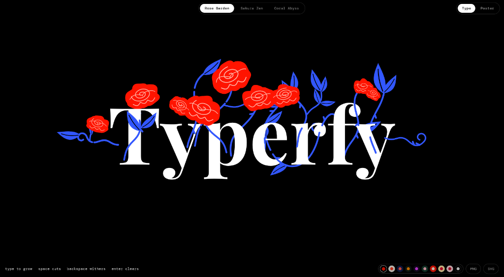
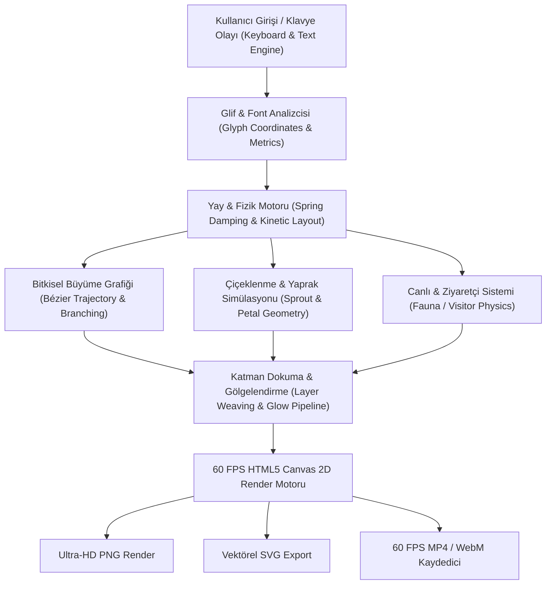

<div align="center">

# 🌿 Typerfy — Generative Botanical Typography Engine

<p align="center">
  <strong>Canlı, organik ve etkileşimli bitkisel tipografi ve generatif sanat motoru.</strong><br>
  <em>Harfler hayat bulsun: Sarmaşıklar, güller, kiraz çiçekleri ve biyo-lüminesans deniz canlıları ile kinetik tipografi deneyimi.</em>
</p>

[](LICENSE)
[](https://github.com/omerfys/Typerfy/stargazers)
[](https://developer.mozilla.org/en-US/docs/Web/JavaScript)
[](https://developer.mozilla.org/en-US/docs/Web/API/Canvas_API)
[](https://github.com/omerfys/Typerfy)
[](https://github.com/omerfys/Typerfy)

<br><br>

<p align="center">
  
</p>

<br>

> **Typerfy**, tarayıcı üzerinde saf HTML5 Canvas 2D ve JavaScript ile çalışan; yazı yazıldıkça harflerin gövdesinden organik sarmaşıklar, yapraklar, güller, sakura çiçekleri ve deniz canlıları filizlendiren yeni nesil bir **generatif tipografi (generative typography)** ve **hareketli grafik (motion poster)** stüdyosudur.

[🌐 Canlı Demo & Başlangıç](#-hızlı-başlangıç--kurulum) • [✨ Özellikler](#-özellikler-features) • [🎨 Temalar](#-temalar--görsel-stiller) • [🎬 Dışa Aktarma](#-dışa-aktarma-formatları-export) • [📊 Mimari](#-generatif-motor-mimarisi) • [English Summary](#-english-overview)

---

</div>

## 📑 İçindekiler (Table of Contents)

- [🌟 Proje Vizyonu](#-proje-vizyonu)
- [✨ Özellikler (Features)](#-özellikler-features)
- [📊 Generatif Motor Mimarisi](#-generatif-motor-mimarisi)
- [🎨 Temalar & Görsel Stiller](#-temalar--görsel-stiller)
  - [1. 🌹 Rose Garden (Gül Bahçesi)](#1--rose-garden-gül-bahçesi)
  - [2. 🌸 Sakura Zen (Japon Kiraz Çiçeği)](#2--sakura-zen-japon-kiraz-çiçeği)
  - [3. 🌊 Coral Abyss (Derin Deniz Mercanı)](#3--coral-abyss-derin-deniz-mercanı)
- [🎭 Hareket & Animasyon Modları (Motion Presets)](#-hareket--animasyon-modları-motion-presets)
- [🚀 Hızlı Başlangıç & Kurulum](#-hızlı-başlangıç--kurulum)
- [🎛️ Canlı Parametreler & Kontrol Paneli](#️-canlı-parametreler--kontrol-paneli)
- [🎬 Dışa Aktarma Formatları (Export)](#-dışa-aktarma-formatları-export)
- [⌨️ Kısayol Tuşları & Etkileşim](#️-kısayol-tuşları--etkileşim)
- [⚡ Performans & Sıfır Bağımlılık Mimarisi](#-performans--sıfır-bağımlılık-mimarisi)
- [❓ Sıkça Sorulan Sorular (FAQ)](#-sıkça-sorulan-sorular-faq)
- [🌍 English Overview](#-english-overview)
- [🔍 SEO Anahtar Kelimeler (SEO Index)](#-seo-anahtar-kelimeler-seo-index)
- [📜 Lisans & Yazar](#-lisans--yazar)

---

## 🌟 Proje Vizyonu

Geleneksel tipografi statiktir. **Typerfy**, tipografiyi canlı ve biyolojik bir organizmaya dönüştürür. Klavyeye bastığınız her karakter; kendi fizik kurallarına, çekim alanına, büyüme eğrilerine (Bézier growth trajectories) ve mikro faunasına sahip bir ekosistem başlatır.

İster sosyal medya içerikleri için 1080x1080 hareketli posterler hazırlayın, ister baskı için vektörel SVG veya ultra yüksek çözünürlüklü PNG üretin, Typerfy tasarımcılar, sanatçılar ve kreatif kodlayıcılar için eksiksiz bir stüdyo ortamı sunar.

---

## ✨ Özellikler (Features)

- 🌿 **Dinamik Organik Büyüme (Procedural Flora Growth):** Harflerin gövdesinden, seriflerinden ve uç noktalarından matematiksel yayılma algoritmalarıyla fışkıran kökler, sarmaşıklar ve dallar.
- 🔤 **Fizik Destekli Kinetik Tipografi (Kinetic Physics):** Yaylanma sönümleme (spring damping), sürükleme kuvveti ve dinamik çarpışma fiziği ile canlı tepki veren harf glifleri.
- 🦋 **Etkileşimli Mikro Canlılar (Fauna & Creatures):** Ekranda harflerin etrafında uçuşan kelebekler, yusufçuklar ve derin sularda yüzen ışıldayan deniz anaları.
- 🎨 **3 Eşsiz Tema & Palet:** Klasik *Rose Garden*, dingin *Sakura Zen* ve biyo-lüminesans *Coral Abyss*.
- 📐 **Çoklu Çözünürlük & Poster Modu:** Serbest yazım modu (Type Mode) ve sosyal medya kare formatı (1080×1080 Poster Mode).
- 🎥 **Kayıpsız Video & Vektör Dışa Aktarma:** 60 FPS WebM/MP4 video kaydı, kayıpsız HD PNG ve vektör tabanlı SVG indirme.
- 🎛️ **Gelişmiş Gerçek Zamanlı Parametreler:** Dal sayısı, sarmaşık kalınlığı, çiçek yoğunluğu, rüzgar kuvveti ve parıltı efektleri üzerinde tam denetim.
- ⚡ **Saf Web Teknolojisi & Sıfır Bağımlılık:** React, Vue, Three.js veya ağır harici kütüphaneler olmadan saf vanilla JavaScript ve Canvas 2D performansı.

---

## 📊 Generatif Motor Mimarisi

Typerfy'nin kalbinde, glif koordinat haritalaması, spline eğri fiziği ve parçacık sistemlerini birleştiren modüler bir render boru hattı (pipeline) yer alır:



---

## 🎨 Temalar & Görsel Stiller

Typerfy, her biri özel tipografi seçimi, renk paletleri ve botanik geometrilere sahip 3 ana tema sunar:

| Tema Adı | Tipografi Fontu | Bitkisel Geometri | Atmosferik Canlılar | Renk Paleti |
| :--- | :--- | :--- | :--- | :--- |
| **🌹 Rose Garden** | *Playfair Display* | Dikenli sarmaşıklar, tırtıklı yapraklar, spiral gül goncaları | Kırmızı & Altın Kelebekler | `#FF1400`, `#3257FF`, `#FFB4A8`, `#0A0A0A` |
| **🌸 Sakura Zen** | *Cormorant Garamond* | Ahşap bonsai dalları, altın tohumlu 5 taç yapraklı sakura | Kızıl Yusufçuklar | `#FFAAA6`, `#FF8B94`, `#D8D8D8`, `#121417` |
| **🌊 Coral Abyss** | *Cinzel / Playfair* | Deniz yosunları, 12 dokunaçlı incili deniz şakayıkları | Transparan Deniz Anaları | `#00F5D4`, `#7B2CBF`, `#9D4EDD`, `#03071E` |

---

### 1. 🌹 Rose Garden (Gül Bahçesi)
Klasik zarafet ve yüksek kontrastlı modern bir estetik. Harfler kalın gövdeli *Playfair Display* serif karakterleriyle çizilir.
- **Botanik Yapı:** Harf gövdelerinden fışkıran kıvrımlı kırmızı ve kobalt mavisi sarmaşıklar, sivri dikenler ve katmanlı spiral güller.
- **Canlılar:** Harflerin üzerinde süzülen, kanat çırpan zarif kelebekler.
- **Karakter:** Yoğun, tutkulu ve avant-garde moda estetiği.

---

### 2. 🌸 Sakura Zen (Japon Kiraz Çiçeği)
Dinginlik, minimalizm ve geleneksel Doğu sanatının esintisi.
- **Tipografi:** İnce hatlı, zarif *Cormorant Garamond*.
- **Botanik Yapı:** İnce ahşap dokulu dallar, uçuşan pembe sakura yaprakları ve ortasında altın rengi minik tohumlar barındıran beş taç yapraklı çiçekler.
- **Canlılar:** Rüzgarda süzülen kızıl kanatlı yusufçuklar (dragonflies).
- **Karakter:** Huzurlu, hafif ve şiirsel.

---

### 3. 🌊 Coral Abyss (Derin Deniz Mercanı)
Okyanusun derinliklerindeki biyo-lüminesans ekosistem.
- **Tipografi:** Heybetli ve mistik *Cinzel*.
- **Botanik Yapı:** Akıntıyla salınan derin deniz yosunları, ışık saçan 12 kollu deniz anemonları ve merkezlerinde parıldayan inciler.
- **Canlılar:** Saydam gövdeli, arkasında ışıklı dokunaçlar bırakan deniz anaları.
- **Karakter:** Fütüristik, gizemli ve büyüleyici neon ışıltıları.

---

## 🎭 Hareket & Animasyon Modları (Motion Presets)

Poster modunda harflerin ve bitkilerin nasıl hayat bulacağını belirleyen 7 özel animasyon algoritması:

1. **🌬️ Breathe:** Yumuşak, nefes alan ritmik organik genişleme ve daralma.
2. **🌱 Grow & Wither:** Sonsuz bir döngüde doğuş, büyüme, olgunlaşma ve solma çevrimi.
3. **⌨️ Typed:** Karakterlerin daktilo ritmiyle tek tek ekrana gelerek filizlenmesi.
4. **💨 Gust:** Ekranda esen rüzgar simülasyonuyla yaprakların ve dalların savrulması.
5. **✨ Reach:** Sarmaşıkların yukarıya, ışığa doğru uzanma ve tırmanma hareketi.
6. **💥 Scatter:** Patlama ve dağılma fiziğiyle harflerin etrafa saçılıp yeniden toplanması.
7. **🦋 Visitor:** Ziyaretçi canlıların (kelebek/yusufçuk/deniz anası) hareketine odaklanan kamera ve akış dinamiği.

---

## 🚀 Hızlı Başlangıç & Kurulum

Typerfy tamamen sıfır bağımlılıkla çalışacak şekilde tasarlanmıştır. Hiçbir paket yüklemenize (`npm install`) gerek yoktur.

### Gereksinimler
- Modern bir web tarayıcısı (Chrome, Edge, Firefox, Safari, Brave, Opera)
- *(İsteğe bağlı)* Yerel sunucu için [Node.js](https://nodejs.org/) (v14+) veya herhangi bir HTTP sunucusu (Live Server, Python HTTP server).

### 1. Projeyi Klonlayın
```bash
git clone https://github.com/omerfys/Typerfy.git
cd Typerfy
```

### 2. Tek Tıkla Başlatın (Windows)
Klasördeki `start.bat` dosyasına çift tıklayarak hem sunucuyu hem de tarayıcıyı anında açabilirsiniz.

### 3. Manuel Olarak Başlatma (Terminal)
```bash
node server.js
```

Tarayıcınızda açın:
```text
http://localhost:3001/
```

*(Alternatif olarak doğrudan `index.html` dosyasını tarayıcınızda çift tıklayarak da açabilirsiniz!)*

---

## 🎛️ Canlı Parametreler & Kontrol Paneli

Sağ ve sol panel kontrolleri üzerinden generative motoru anlık olarak özelleştirebilirsiniz:

```text
┌───────────────────────────────────────────────────────────┐
│                    TYPERFY KONTROLLERİ                    │
├───────────────────────┬───────────────────────────────────┤
│ Parametre             │ Açıklama                          │
├───────────────────────┼───────────────────────────────────┤
│ 🌿 Vine Count         │ Harf başına düşen ana dal sayısı │
│ 📏 Vine Length        │ Sarmaşıkların uzama mesafesi     │
│ 🌸 Bloom Density      │ Çiçek açma olasılığı ve sıklığı   │
│ 💨 Wind & Gust Force  │ Rüzgar dalgalanma şiddeti         │
│ 💡 Glow Intensity     │ Neon & lüminesans parıltı gücü    │
│ ⏳ Animation Speed    │ Canlı fiziğin çalışma hızı        │
│ 🎯 Force Sensitivity  │ Fare/imleç itme çekme kuvveti    │
└───────────────────────┴───────────────────────────────────┘
```

---

## 🎬 Dışa Aktarma Formatları (Export)

Tasarımınızı sosyal medya, portfolyo veya baskı için tek tıkla kaydedin:

- **🖼️ High-Res PNG:** Şeffaf veya renkli arka planla 4K'ya kadar kayıpsız piksel çıktısı.
- **📐 Scalable Vector (SVG):** İllüstratör, Figma veya plotter kesim cihazları için saf vektörel Bézier eğrileri.
- **🎥 WebM / MP4 Video Loop:** 1080x1080 kare formatında 30/60 FPS kusursuz döngüsel video kaydı.
- **📦 ZIP Frame Sequence:** After Effects veya Premiere Pro için kare kare PNG sekansı.

---

## ⌨️ Kısayol Tuşları & Etkileşim

| Kısayol | Fonksiyon |
| :--- | :--- |
| `Metin Yazımı` | Harfleri anında ekrana ekler ve büyüme sürecini başlatır |
| `Backspace` | Harfi ve ona bağlı tüm bitkileri organik olarak soldurarak siler |
| `Space` | Boşluk bırakarak yeni kelime kümesi oluşturur |
| `Fare Sürükleme` | Harfleri ve sarmaşıkları yerçekimi/fizik kuvvetiyle çeker |
| `Çift Tıklama` | Seçili alanda anında tam çiçeklenme (Super Bloom) tetikler |
| `P Tuşu` | Type Mode <-> 1080x1080 Poster Mode arasında geçiş yapar |

---

## ⚡ Performans & Sıfır Bağımlılık Mimarisi

- **60 FPS Hardware-Accelerated 2D Canvas:** `requestAnimationFrame` döngüsü ile optimize edilmiş GPU destekli çizim.
- **Sıfır Dış Kütüphane:** Boyutu şişiren dev framework'ler yok; anında açılır, sıfır ağ gecikmesi.
- **Hafıza Yönetimi & Garbage Collection:** Ekrandan silinen veya solan gliflerin belleği anında serbest bırakılır.
- **Responsive Canvas:** Mobil dokunmatik ekranlar, tabletler ve ultra geniş monitörlerle tam uyumlu dinamik viewport hesaplama.

---

## ❓ Sıkça Sorulan Sorular (FAQ)

<details>
<summary><strong>1. Typerfy'yi ticari projelerimde kullanabilir miyim?</strong></summary>
Evet! Typerfy, MIT lisansı ile lisanslanmıştır. Ürettiğiniz görselleri, videoları ve kod tabanını ticari veya kişisel projelerinizde özgürce kullanabilirsiniz.
</details>

<details>
<summary><strong>2. Video kaydı neden bazen uzun sürüyor?</strong></summary>
Tarayıcı tabanlı `MediaRecorder` API'si 60 FPS tam çözünürlükte kareleri işlerken bilgisayarınızın işlemci ve grafik gücünü kullanır. Kayıt tamamlandığında otomatik olarak `.mp4` veya `.webm` olarak iner.
</details>

<details>
<summary><strong>3. Kendi yazı tipimi veya renk paletimi ekleyebilir miyim?</strong></summary>
Kesinlikle. `index.html` dosyası içindeki tema tanımlarını inceleyerek yeni bir Google Font bağlantısı verebilir ve kendi HEX renk dizinizi tanımlayabilirsiniz.
</details>

---

## 🌍 English Overview

**Typerfy** is a state-of-the-art, zero-dependency generative botanical typography canvas application built with vanilla JavaScript and HTML5 Canvas 2D. As you type, the engine procedurally generates intricate vines, leaves, blossoms, and marine life wrapping organically around every letter.

### Key Highlights:
- **3 Dynamic Themes:** *Rose Garden* (vibrant roses & butterflies), *Sakura Zen* (delicate cherry blossoms & dragonflies), *Coral Abyss* (deep sea anemones & bioluminescent jellyfish).
- **Physical Spring Damping:** Interactive letters that bounce, stretch, and react to cursor physics.
- **Studio Export Suite:** 1080×1080 animated MP4/WebM video loop recorder, vector SVG exporter, and high-resolution PNG snapshots.
- **Lightweight & Blazing Fast:** 60 FPS hardware-accelerated canvas rendering with zero external NPM runtime dependencies.

---

## 🔍 SEO Anahtar Kelimeler (SEO Index)

`Typerfy` • `Generative Typography` • `Generatif Tipografi` • `Botanical Typography` • `Creative Coding` • `Canvas 2D` • `JavaScript Art` • `HTML5 Canvas Animation` • `Kinetic Type` • `Interactive Typography` • `Organic Growth Simulation` • `Rose Garden Typography` • `Sakura Zen Canvas` • `Coral Reef Bioluminescence` • `Poster Generator` • `1080x1080 Motion Design` • `Zero Dependency JS` • `Omerfy` • `Bézier Curve Growth` • `Creative Code Art` • `SVG Vector Generator` • `Canvas Video Recorder`

---

## 📜 Lisans & Yazar

Bu proje [MIT Lisansı](LICENSE) altında açık kaynak olarak sunulmuştur.

Geliştirici: **[@omerfys](https://github.com/omerfys)**  
GitHub Deposu: [https://github.com/omerfys/Typerfy](https://github.com/omerfys/Typerfy)

⭐ **Projeyi beğendiyseniz GitHub üzerinden yıldız vermeyi unutmayın!**
